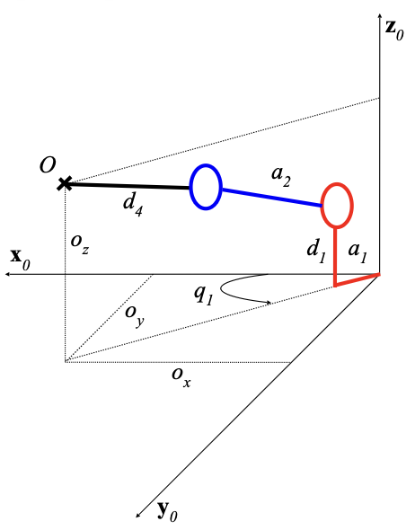
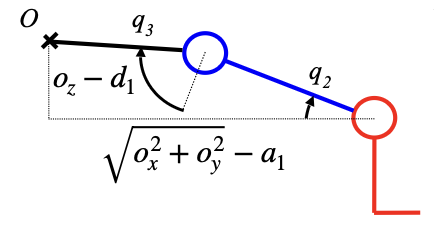

# Projet : Robot arm pick and place

**IT Project Management Project**

The aim of the project is to carry out "pick and place" using a Lego robotic arm fitted with a gripper. This project includes a vision part which consists of detecting the objects to be moved by the camera and their coordinates. Once this has been done, the end effector of our robotic arm will have to move to the coordinates of the box, pick it up (_pick_), then move it to a given position (_place_).

## Prerequisites

On the PC:

- Install the [LEGO® MINDSTORMS® EV3 MicroPython
  ](https://marketplace.visualstudio.com/items?itemName=lego-education.ev3-micropython) VS Code extension

## The vision part

The camera is positioned above the stage at a fixed distance and detects the coordinates of the centre of gravity of each part. It then returns these coordinates to the base reference frame linked to the robot's platform.

## The control part

The inverse geometric model (IGM) of the robot can be used to determine the joint co-ordinates $\mathbf{q} = [q_1, q_2, q_3]^T$ required for each of the robot's joints to move it to a precise position, represented by the co-ordinates (x, y, z, $\alpha$) where the crate is to be brought.

The MGI can be determined using the following figure:

|           Inverse Kinematics           |                 model                  |
| :------------------------------------: | :------------------------------------: |
|  |  |

<span style="color:gray"><small>_source: Cours de Robotique Jacques Gangloff - Telecom Physique Strasbourg_</small></span>

The obvious joint coordinate is obviously $q_1 = \alpha$, or $q_1 = arctan2 (o_y,o_x)$ if the $\alpha$ parameter is not available.

## Algorithm

```python

# Arm Length
ARM_LENGTH1 = a1
ARM_LENGTH2 = a2
ARM_LENGTH3 = a3

# Calibration
initial_q1 = 0.0
initial_q2 = 0.0
initial_q3 = 0.0

motor_platform.reset_angle(initial_q1)
motor_arm_1.reset_angle(initial_q2)
motor_arm_2.reset_angle(initial_q3)
motor_gripper.reset_angle(0)

current_q1 = initial_q1
current_q2 = initial_q2
current_q3 = initial_q3

Function to_degrees(q1, q2, q3):
    Return q1_deg, q2_deg, q3_deg

Function MGI(x, y, z, alpha):
    q1 = alpha
    q2 = f(x,y,z,ARM_LENGTH1, ARM_LENGTH2)
    q3 = f(x,y,z,ARM_LENGTH1, ARM_LENGTH2)
    return q1, q2, q3

Function move_to(x, y, alpha):
    global current_q1, current_q2, current_q3
    q1,q2,q3 = MGI(x,y,z,alpha)
    q1_deg, q2_deg, q3_deg = to_degrees(q1, q2, q3)

    motor_platform.move(velocity, q1_deg)
    motor_arm_1.move(velocity, q2_deg)
    motor_arm_2.move(velocity, q3_deg)

    # Update current position
    current_q1 = q1
    current_q2 = q2
    current_q3 = q3

# USE CASE

moto_to(20, 30, 10, 25)

```
